# Generative Modeling

With generative modeling, we aim to learn how to generate new samples from the same distribution of the given training data. Specifically, there are two major objectives: 

- Learn $p_{\text{model}}(x)$ that approximates true data distribution $p_{\text{data}}(x)$
- Sampling new $x$ from $p_{\text{model}}(x)$

The former can be structured as learning how likely a given sample is drawn from a true data distribution; the latter means the model should be able to produce new samples that are similar but not exactly the same as the training samples. One way to judge if the model has learned the correct underlying representation of the training data distribution is the quality of the new samples produced by the trained model. 

These objectives can be formulated as density estimation problems. There are two different approaches: 

- **Explicit density estimation**: explicitly define and solve for $p_{\text{model}}(x)$
- **Implicit density estimation**: learn model that can sample from $p_{\text{model}}(x)$ without explicitly define it 

The explicit approach can be challenging because it is generally difficult to find an expression for image likelihood function from a high dimensional space. The implicit approach may be preferable in situations that the only interest is to generate new samples. In this case, instead of finding the specific expression of the density function, we can simply training the model to directly sample from the data distribution without going through the process of explicit modeling. 

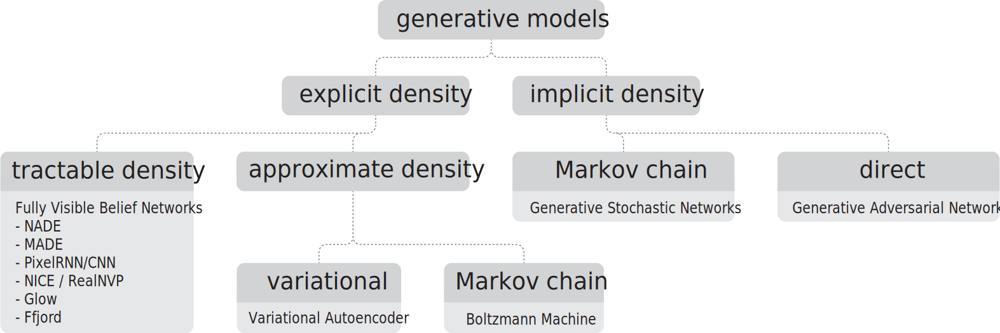</img>

Generative models are widely used in various computer vision tasks. For instance, they are used in super-resolution applications in which the model fills in the details of the low resolution inputs and generates higher resolution images. They are also used for colorization in which greyscale images get converted to color images. 

# PixelRNN and PixelCNN

PixelRNN and PixelCNN [[van den Oord et al., 2016]](https://arxiv.org/abs/1601.06759) are examples of a **fully visible belief network (FVBN)** in which data likelihood function $p(x)$ is explicitly modeled given image input $x$: 

\( p(x) = p(x_1, x_2, \cdots, x_n) \)

where $x_1, x_2, \cdots$ are each pixel in the image. In other words, the likelihood of an image (LHS) is the joint likelihood of each pixel in the image (RHS). We then use chain rule to decompose the joint likelihood into product of 1-d distributions: 

\( \displaystyle p(x) = \prod_{i=1}^{n} p(x_i \mid x_1, \cdots, x_{i-1}) \)

where each distribution in the product gives the probability of $i$th pixel value given all previous pixels. Choice of pixel ordering (hence "previous") might have implications on computational efficiencies in training and inference. Following is an example of ordering in which each pixel $x_i$ (in red) is conditioned on all the previously generated pixels left and above of $x_i$ (in blue): 

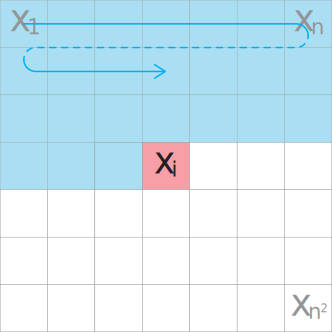</img>

To train the model, we could try to maximize the defined likelihood of the training data. 

## PixelRNN

The problem with above naive approach is that the conditional distributions can be extremely complex. To mitigate the difficulty, the PixelRNN instead expresses conditional distribution of each pixel as sequence modeling problem. It uses RNNs (more specifically LSTMs) to model the joint likelihood function $p(x_i \mid x_1, \cdots, x_{i-1})$. The main idea is that we model the dependencies of one pixel on all previous pixels by the hidden state of an RNN. Then the process of feeding previous predicted pixel back to the network to get the next pixel allows us to sequentially generate all pixels of an image. 

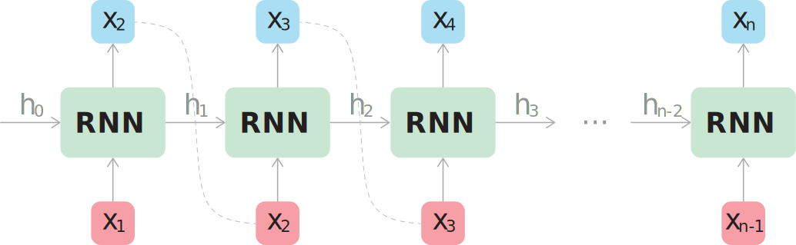</img>

Another thing that the PixelRNN model does slightly differently is that it defines pixel order diagonally. This allows some level of parallelization, which makes training and generation a bit faster. With this ordering, generation process starts from the top-left corner, and then makes its way down and right until the entire image is produced. 

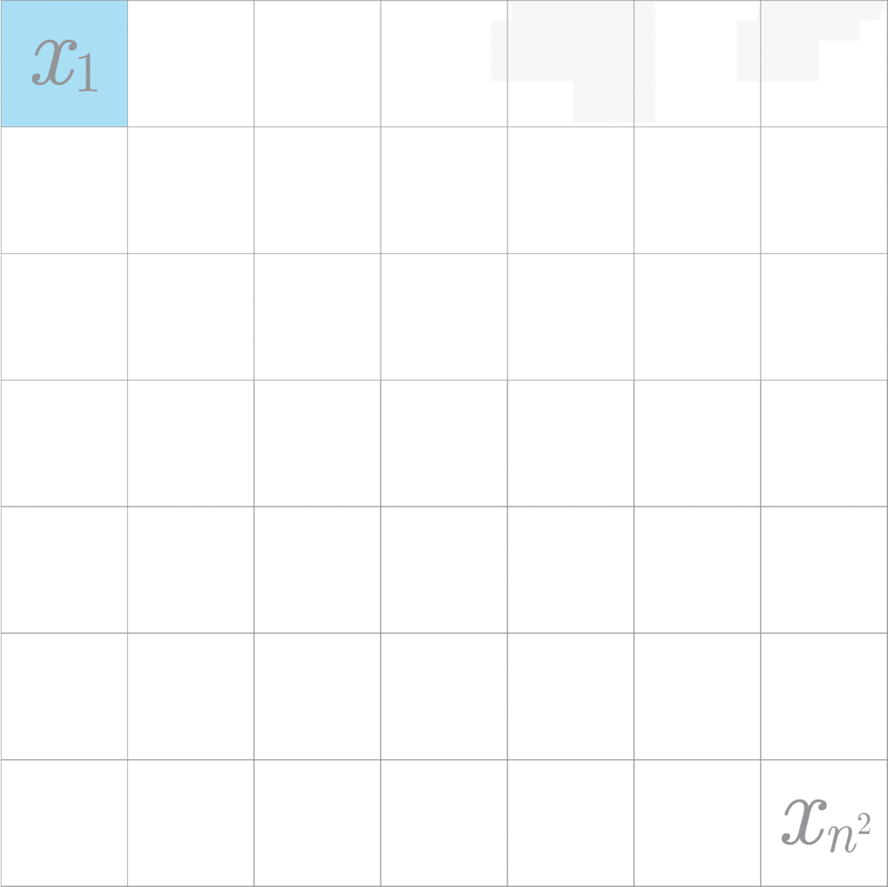</img>

## PixelCNN

Because the generation process even with this diagonal ordering is still largely sequential, it is expensive to train such model. To achieve further parallelization, instead of taking all previous pixels into consideration, we could instead only model dependencies on pixels in a context region. This gives rise to the PixelCNN model in which a context region is defined by a masked convolution. The receptive field of a masked convolution is an incomplete square around a central pixel (darker blue squares). This ensures that each pixel only depends on the already generated pixels in the region. The paper shows that with enough masked convolutional layers, the effective receptive field is the same as the pixel generation process that directly models dependencies on all previous pixels (all blue squares), like the PixelRNN model. 

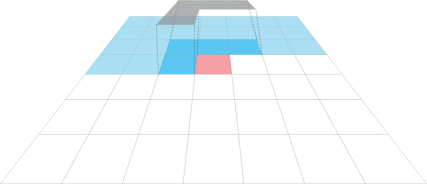</img>

Because context region values are known from training images, PixelCNN is faster in training thanks to convolution parallelizations. However, generation is still slow as the process is inherently sequential. For instance, for a $32 \times 32$ image, the model needs to perform forward pass $1024$ times to generate a single image. 

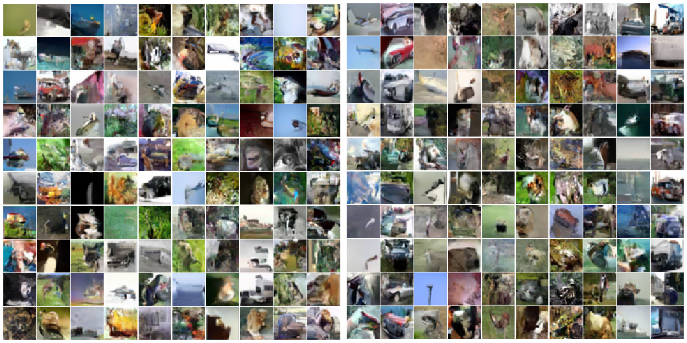</img>

From the generation samples on [``CIFAR-10``](https://www.cs.toronto.edu/~kriz/cifar.html) (left) and [``ImageNet``](https://www.image-net.org/) (right), we see these models are able to capture the distribution of training data to some extent, yet the generated samples do not look like natural images. Later models like flow based deep generative models are able to strike a better balance between training and generation efficiencies, and generate better quality images. 

In summary, PixelRNN and PixelCNN models explicitly compute likelihood, and thus are relatively easy to optimize. The major drawback of these models is the sequential generation process which is time consuming. There have been follow-up efforts on improving PixelCNN performance, ranging from architecture changes to training tricks. 

# Variational Autoencoder

We introduce a new latent variable $z$ that allows us to decompose the data likelihood as the marginal distribution of the conditional data likelihood with respect to this latent variable $z$: 

\( \displaystyle p_{\theta}(x) = \int p_{\theta}(z) \cdot p_{\theta}(x \mid z) ~dz \)

In other words, all pixels of an image are independent with each other given latent variable $z$. This makes simultaneous generation of all pixels possible. However, we cannot directly optimize this likelihood expression. Instead, we optimize a lower bound of this expression to approximate the optimization we'd like to perform. 

## Autoencoder

On a high-level, the goal of an autoencoder is to learn a lower-dimensional feature representation from un-labeled training data. The "encoder" component of an autoencoder aims at compressing input data into a lower-dimensional feature vector $z$. Then the "decoder" component decodes this feature vector and converts it back to the data in the original dimensional space. 

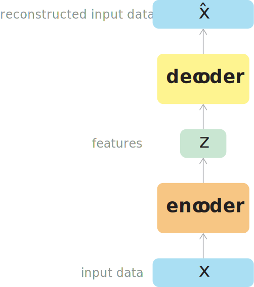</img>

The idea of the dimensionality reduction step is that we want every dimension of the feature vector $z$ captures meaningful factors of variation in data. We feed the feature vector into the decoder network and have it learn how to reconstruct the original input data with some pre-defined pixel-wise reconstruction loss (L2 is one of the most common choices). By training an autoencoder model, we hope feature vector $z$ eventually encodes the most essential information about possible variables of the data. 

Now the autoencoder gives a way to effectively represent the underlying structure of the data distribution, which is one of the objectives of generative modeling. However, since do not know the entire latent space that $z$ is in (not every latent feature in the latent space can be decoded into a meaningful image), we are unable to arbitrarily generate new images from an autoencoder. 

## Variational Autoencoder

To be able to sample from the latent space, we take a probabilistic approach to autoencoder models. Assume training data $\big\{x^{(i)}\big\}_{i=1}^{N}$ is generated from the distribution of unobserved latent representation $z$. So $x$ follows the conditional distribution given $z$; that is, $p_{\theta^{\ast}}(x \mid z^{(i)})$. And $z^{(i)}$ follows the prior distribution $p_{\theta^{\ast}}(z)$. In other words, we assume each image $x$ is generated by first sampling a new $z$ that has a slight different factors of variation and then sampling the image conditionally on that chosen variable $z$. 

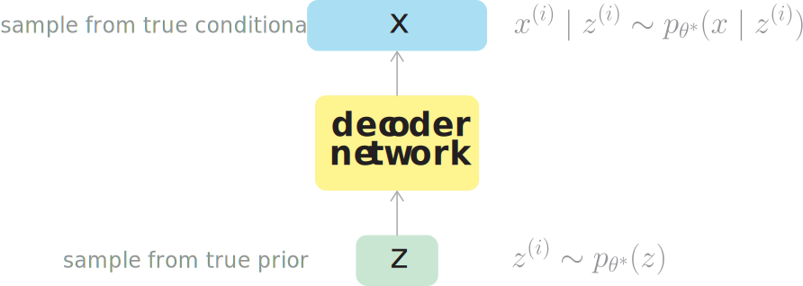</img>

With variational autoencoder [[Kingma and Welling, 2014]](https://arxiv.org/abs/1312.6114), we would like to estimate true parameters $\theta^{\ast}$ of both the prior and conditional distributions of the training data. We choose prior $p_{\theta}(z)$ to be a simple distribution (e.g. a diagonal/isotropic Gaussian distribution), and use a neural network, denoted as **decoder** network, to decode a latent sample from prior $pp_{\theta}(z)$ to a conditional distribution of the image $p_{\theta}(x \mid z)$. We have the data likelihood: 

\(\displaystyle p_{\theta}(x) = \int p_{\theta}(z) \cdot p_{\theta}(x \mid z) ~dz \)

We note that to train the model, we need to compute the integral which involves computing $p(x \mid z)$ for every possible $z$. Hence it is intractably to directly optimize the likelihood expression. We could use Monte Carlo estimation technique but there will incur high variance because of the high dimensionality nature of the density function. If we look at the posterior distribution using the Baye's rule: 

\( p_{\theta}(z \mid x) = \dfrac{p_{\theta}(x \mid z) \cdot p_{\theta}(z)}{p_{\theta}(x)} \)

we see it is still intractable to compute because $p_{\theta}(x)$ shows up in the denominator. 

To make it tractable, we instead learn another distribution $q_{\phi}(z \mid x)$ that approximates the true posterior distribution $p_{\theta}(z \mid x)$. We denote this approximate distribution as probabilistic **encoder** because given an input image, it produces a distribution over the possible values of latent feature vector $z$ from which the image could have been sampled from. This approximate posterior distribution $q_{\phi}(z \mid x)$ allows us to derive a lower bound on the data likelihood. We then can optimize the tractable lower bound instead. The goal of the variational inference is to approximate the unknown posterior distribution $p_{\theta}(z \mid x)$ from only the observed data. 

### Tractable Lower Bound

To derive the tractable lower bound, we start from the log likelihood of an observed example: 

\( \begin{aligned}
  \log p_{\theta}(x^{(i)}) &= \mathbb{E}_{z \sim q_{\phi}(z \mid x^{(i)})} \Big[\log p_{\theta}(x^{(i)})\Big] \quad \cdots \small\mathsf{(1)} \\
  &= \mathbb{E}_{z} \bigg[\log \frac{p_{\theta}(x^{(i)} \mid z) \cdot p_{\theta}(z)}{p_{\theta}(z \mid x^{(i)})}\bigg] \quad \cdots \small\mathsf{(2)} \\
  &= \mathbb{E}_{z} \bigg[\log \bigg(\frac{p_{\theta}(x^{(i)} \mid z) \cdot p_{\theta}(z)}{p_{\theta}(z \mid x^{(i)})} \cdot \frac{q_{\phi}(z \mid x^{(i)})}{q_{\phi}(z \mid x^{(i)})}\bigg)\bigg] \quad \cdots \small\mathsf{(3)} \\
  &= \mathbb{E}_{z} \Big[\log p_{\theta}(x^{(i)} \mid z) \Big] - \mathbb{E}_{z} \bigg[\log \frac{q_{\phi}(z \mid x^{(i)})}{p_{\theta}(z)}\bigg] + \mathbb{E}_{z} \bigg[\log \frac{q_{\phi}(z \mid x^{(i)})}{p_{\theta}(z \mid x^{(i)})}\bigg] \quad \cdots \small\mathsf{(4)} \\
  &= \mathbb{E}_{z} \Big[\log p_{\theta}(x^{(i)} \mid z) \Big] - D_{\mathrm{KL}} \Big(q_{\phi}(z \mid x^{(i)}) \parallel p_{\theta}(z)\Big) + D_{\mathrm{KL}} \Big(q_{\phi}(z \mid x^{(i)}) \parallel p_{\theta}(z \mid x^{(i)})\Big) \quad \cdots \small\mathsf{(5)}
\end{aligned} \)

- Step $\mathrm{(1)}$: the true data distribution is independent of the estimated posterior $q_{\phi}(z \mid x^{(i)})$; moreover, since $q_{\phi}(z \mid x^{(i)})$ is represented by a neural network, we are able to sample from distribution $q_{\phi}$. 

- Step $\mathrm{(2)}$: by the Baye's rule: 

\( \begin{aligned}
  & p_{\theta}(z \mid x) = \dfrac{p_{\theta}(x \mid z) \cdot p_{\theta}(z)}{p_{\theta}(x)} \\
  \Longrightarrow \quad & p_{\theta}(x) = \dfrac{p_{\theta}(x \mid z) \cdot p_{\theta}(z)}{p_{\theta}(z \mid x)}
\end{aligned} \)

- Step $\mathrm{(3)}$: multiplying the expression by $1 = \dfrac{q_{\phi}(z \mid x^{(i)})}{q_{\phi}(z \mid x^{(i)})}$

- Step $\mathrm{(4)}$: by logarithm properties as well as linearity of expectation: 

\( \begin{aligned}
  &~ \mathbb{E}_{z} \bigg[\log \bigg(\frac{p_{\theta}(x^{(i)} \mid z) \cdot p_{\theta}(z)}{p_{\theta}(z \mid x^{(i)})} \cdot \frac{q_{\phi}(z \mid x^{(i)})}{q_{\phi}(z \mid x^{(i)})}\bigg)\bigg] \\
  =&~ \mathbb{E}_{z} \bigg[\log \bigg(p_{\theta}(x^{(i)} \mid z) \cdot \frac{p_{\theta}(z)}{q_{\phi}(z \mid x^{(i)})} \cdot \frac{q_{\phi}(z \mid x^{(i)})}{p_{\theta}(z \mid x^{(i)})}\bigg)\bigg] \\
  =&~ \mathbb{E}_{z} \bigg[\log p_{\theta}(x^{(i)} \mid z) + \log \frac{p_{\theta}(z)}{q_{\phi}(z \mid x^{(i)})} + \log \frac{q_{\phi}(z \mid x^{(i)})}{p_{\theta}(z \mid x^{(i)})}\bigg] \\
  =&~ \mathbb{E}_{z} \bigg[\log p_{\theta}(x^{(i)} \mid z) - \log \frac{q_{\phi}(z \mid x^{(i)})}{p_{\theta}(z)} + \log \frac{q_{\phi}(z \mid x^{(i)})}{p_{\theta}(z \mid x^{(i)})}\bigg] \\
  =&~ \mathbb{E}_{z} \bigg[\log p_{\theta}(x^{(i)} \mid z)\bigg] - \mathbb{E}_{z}\bigg[\log \frac{q_{\phi}(z \mid x^{(i)})}{p_{\theta}(z)}\bigg] + \mathbb{E}_{z}\bigg[\log \frac{q_{\phi}(z \mid x^{(i)})}{p_{\theta}(z \mid x^{(i)})}\bigg] \\
\end{aligned} \)

- Step $\mathrm{(5)}$: by definition of the [Kullback–Leibler divergence](https://en.wikipedia.org/wiki/Kullback%E2%80%93Leibler_divergence). The KL divergence gives a measure of the “distance” between two distributions. 

We see the first term $\mathbb{E}_{z} \Big[\log p_{\theta}(x^{(i)} \mid z) \Big]$ involves $p_{\theta}(x^{(i)} \mid z)$ that is given by the decoder network. With some tricks, this term can be estimated through sampling. 

The second term is the KL divergence between the approximate posterior and the prior (a Gaussian distribution). Assuming the approximate posterior posterior takes on a Gaussian form with diagonal covariance matrix, the KL divergence then has an analytical closed form solution. 

The third term is the KL divergence between between the approximate posterior and the true posterior. Even though we it is intractable to computer, by non-negativity of KL divergence, we know this term is non-negative. 

Therefore we obtain the tractable lower bound of log likelihood of the data: 

\( \log p_{\theta}(x^{(i)}) = \underbrace{\mathbb{E}_{z} \Big[\log p_{\theta}(x^{(i)} \mid z) \Big] - D_{\mathrm{KL}} \Big(q_{\phi}(z \mid x^{(i)}) \parallel p_{\theta}(z)\Big)}_{\mathcal{L}(x^{(i)}; \theta, \phi)} + \underbrace{D_{\mathrm{KL}} \Big(q_{\phi}(z \mid x^{(i)}) \parallel p_{\theta}(z \mid x^{(i)})\Big)}_{\geqslant 0} \)

We note that $\mathcal{L}(x^{(i)}; \theta, \phi)$, as known as the **evidence lower bound (ELBO)**, is differentiable, hence we can apply gradient descent methods to optimize the lower bound. 

The lower bound can also be interpreted as encoder component $D_{\mathrm{KL}} \Big(q_{\phi}(z \mid x^{(i)}) \parallel p_{\theta}(z)\Big)$ that seeks to approximate posterior distribution close to prior; and decoder component $\mathbb{E}_{z} \Big[\log p_{\theta}(x^{(i)} \mid z) \Big]$ that concerns with reconstructing the original input data. 

### Training

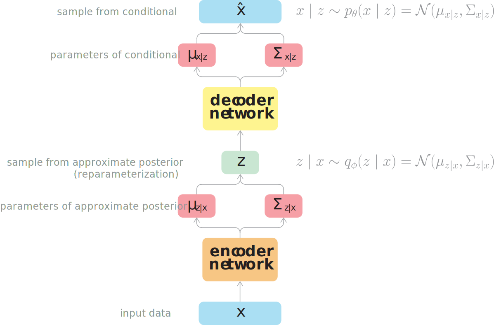</img>

For a given input, we first use the encoder network to to generate the mean $\mu_{z \mid x}$ and variance $\Sigma_{z \mid x}$ of the approximate posterior Gaussian distribution. Notice that here $\Sigma_{z \mid x}$ is represented by a vector instead of a matrix because the approximate posterior is assumed to have a diagonal covariance matrix. Then we can compute the gradient of the KL divergence term $D_{\mathrm{KL}} \Big(q_{\phi}(z \mid x^{(i)}) \parallel p_{\theta}(z)\Big)$ as it has an analytical solution. 

Next we compute the gradient of the expectation term $\mathbb{E}_{z} \Big[\log p_{\theta}(x^{(i)} \mid z) \Big]$. Since $p_{\theta}(x^{(i)} \mid z)$ is represented by the decoder network, we need to sample $z$ from the approximate posterior $\mathcal{N}(\mu_{z \mid x}, \Sigma_{z \mid x})$. However, since $z$ is not part of the computation graph, we won't be able to find the gradient of the expression that entails the sampling process. To solve this problem, we perform **reparameterization**. Specifically, we take advantage of the Gaussian distribution assumption, and sample $\varepsilon \sim \mathcal{N}(0, I)$. Then we represent $z$ as $z = \mu_{z \mid x} + \varepsilon \Sigma_{z \mid x}$. This way $z$ has the same Gaussian distribution as before; moreover, since $\varepsilon$ is seen as an input to the computation graph, and both $\mu_{z \mid x}$ and $\Sigma_{z \mid x}$ are part of the computation graph, the sampling process now becomes differentiable. 

Lastly, we use the decoder network to produce the pixel-wise conditional distribution $p_{\theta}(x \mid z)$. We are now able to perform the maximum likelihood of the original input. In practice, L2 distance between the predicted image and the actual input image is commonly used. 

For every minibatch of input data, we compute the forward pass and then perform the back-propagation. 

### Inference

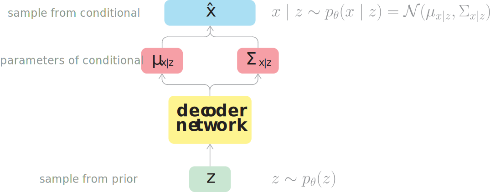</img>

We take a sample $z$ from the prior distribution $p_{\theta}(z)$ (e.g. a Gaussian distribution), then feed the sample into the trained decoder network to obtain the conditional distributions $p_{\theta}(x \mid z)$. Lastly we sample a new image from the conditional distribution. 

### Generated Samples

Since we assumed diagonal prior for $z$, components of latent variable are independent of each other. This means different dimensions of $z$ encode interpretable factors of variation. 

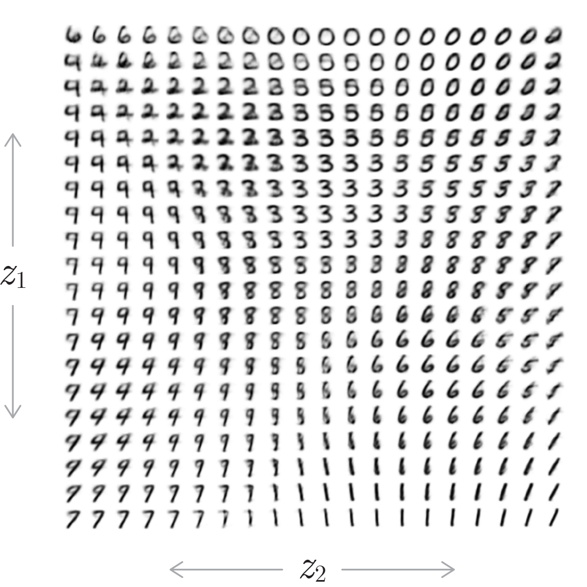</img>

After training the model using a $2$-dimensional latent variable $z$ on [``MNIST``](https://yann.lecun.com/exdb/mnist/), we discover that varying the samples of $z$ would induce interpretable variations in the image space. For instance, one possible interpretation would be that $z_1$ morphs digit ``6`` to ``9`` through ``7``, and $z_2$ is related to the orientation of digits. 

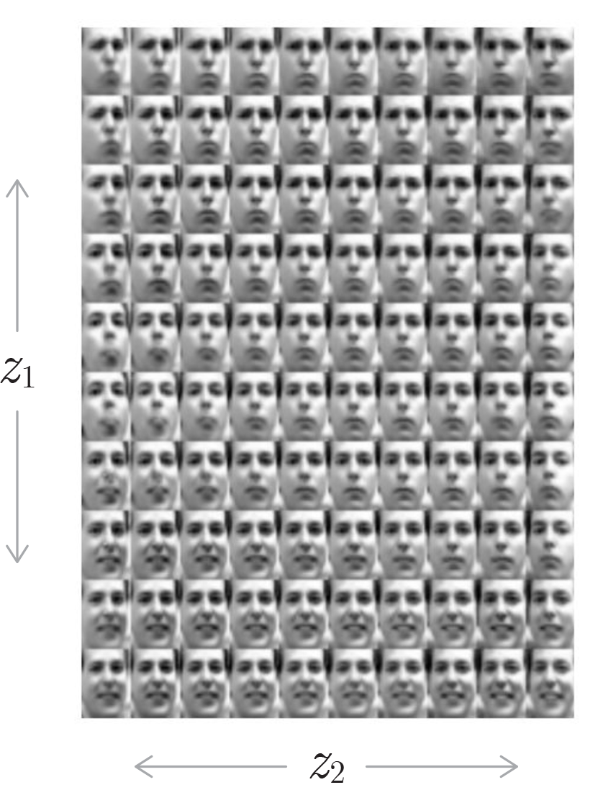</img>

Similarly, we also find that dimensions of latent variable $z$ can be interpretable after training the model on head pose dataset. For instance, it appears $z_1$ encodes degree of smile and $z_2$ encodes head pose orientation. 

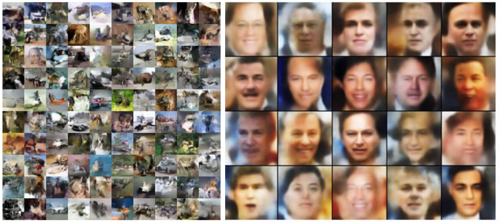</img>

From above generation samples on [``CIFAR-10``](https://www.cs.toronto.edu/~kriz/cifar.html) (left) and labeled face images (right), we see newly generated images are similar to the original ones. However, these generated images are still blurry and generating high quality images is an active area for research. 

# Generative Adversarial Networks (GANs)

We would like to train a model to directly generate high quality samples without modeling any explicit density function $p(x)$. With GAN [[Goodfellow et al., 2014]](https://arxiv.org/abs/1406.2661), our goal is to train a **generator network** to learn transformation from a simple distribution (e.g. random noise) that we can easily sample from to the high-dimensional training distribution followed by the data. The challenge is that because we do not model any data distribution, we don't have the mapping between random sample $z$ to a training image $x$. This means we cannot directly train the model with supervised reconstruction loss. 

To overcome this challenge, we recognize the general objective that all the images generated from the latent space of $z$ should exhibit "realness". In other words, all the generated images should look like they belong to the original training data. To formulate this general objective into a learning objective, we introduce another **discriminator network** that learns to identify whether an image is from the training data distribution or not. Specifically, the discriminator network performs a two-class classification task in which an input image feeds into the network and a label indicating if the input image is from the training data distribution or is produced by the generated network. 

We then can use the output from the discriminator network to compute gradient and perform back-propagation to the generator network to gradually improve the image generation process. Overtime, learning signal from the discriminator will inform the generator on how to produce more "realistic" samples. Similarly, as generated images from the generator become more and more close to the real training data, the discriminator adapt its decision boundary to fit the training data distribution better. The discriminator effectively learns to model the data distribution without explicitly defining it. 

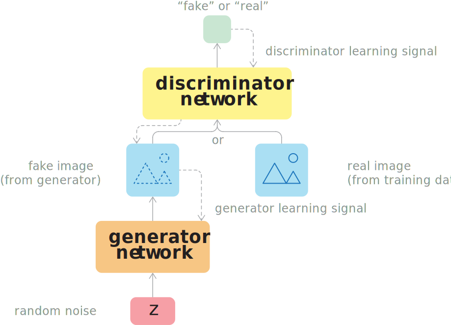</img>

In summary: 

- **discriminator network**: try to distinguish between real and fake images
- **generator network**: try to fool the discriminator by generating real-looking images

## Training GANs

Training GAN can be formulated as the minimax optimization of a two-player adversarial game. Assume that the discriminator outputs likelihood in $(0,1)$ of real image, the objective function is the following: 

\( \displaystyle \min_{\theta_g} \max_{\theta_d} \Big\{\mathbb{E}_{x \sim p_{\mathrm{data}}}\big[\log \underbrace{D_{\theta_d}(x)}_{\mathsf{(1)}}\big] + \mathbb{E}_{z \sim p(z)}\big[\log\big(1 - \underbrace{D_{\theta_d}(G_{\theta_g}(z))\big)}_{\mathsf{(2)}}\big]\Big\} \)

- $\mathsf{(1)}$: $D_{\theta_d}(x)$ is the discriminator output (score) for real data $x$
- $\mathsf{(2)}$: $D_{\theta_d}(G_{\theta_g}(z))\big)$ is the discriminator output (score) for generated fake data $G(z)$

The inner maximization is the discriminator objective. The discriminator aims to find maximizer $\theta_g$ such that real data $D(x)$ is close to $1$ (real) while generated fake data $D(G(z))$ is close to $0$ (fake). 

The outer minimization is the generator objective. The generator aims to find minimizer $\theta_g$ such that generated fake data $D(G(z))$ is close to $1$ (real). This means the generator seeks to fool discriminator into thinking that generated fake data $D(G(z))$ is real. 

Naively, we could alternate between maximization and minimization by performing **gradient ascent on discriminator**: 

\( \displaystyle \max_{\theta_d} \Big\{\mathbb{E}_{x \sim p_{\mathrm{data}}}\big[\log D_{\theta_d}(x)\big] + \mathbb{E}_{z \sim p(z)}\big[\log \big(1 - D_{\theta_d}(G_{\theta_g}(z))\big)\big]\Big\} \)

and **gradient descent on generator**: 

\( \displaystyle \min_{\theta_g} \Big\{\mathbb{E}_{z \sim p(z)}\big[\log \big(1 - D_{\theta_d}(G_{\theta_g}(z))\big)\big]\Big\} \)

However, we note that when a sample is likely fake—hence $D(G(z))$ is small, expression $\log \big(1 - D_{\theta_d}(G_{\theta_g}(z))\big)$ in the generator objective function has small derivative with respect to $D(G(z))$. This means in the beginning of the training, the gradient of the generator objective function is small; that is updates to parameters $\theta_g$ are small. Conversely, the updates are large (strong gradient signal) when samples are already realistic ($D(G(z))$ is large). This creates an unfavorable situation as ideally we would hope the generator is able to learn fast when the discriminator outsmarts the generator. 

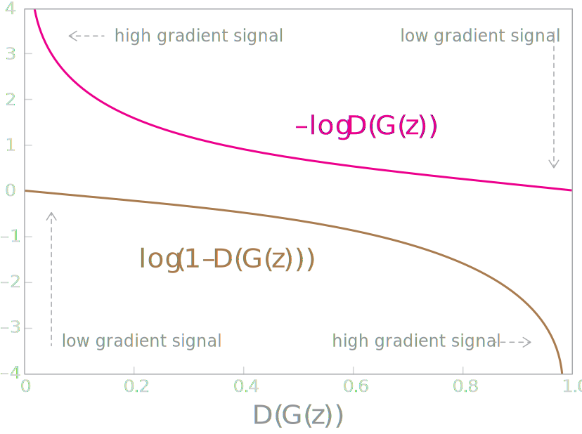</img>

To remedy this problem, we now maximize likelihood of the discriminator being wrong, as opposed to minimizing the likelihood of it being correct: 

\( \displaystyle \max{\theta_g} \Big\{\mathbb{E}_{z \sim p(z)}\big[\log D_{\theta_d}\big(G_{\theta_g}(z)\big)\big]\Big\} \)

The objective remains unchanged, yet there will be higher gradient signal to the generator for unrealistic samples (in the eyes of the discriminator), which improves training performance. 

> **for** number of training iterations **do**:  
> &nbsp;&nbsp; **for** $k$ steps **do**:  
> &nbsp;&nbsp;&nbsp;&nbsp; - Sample minibatch of $m$ noise samples $\{z^{(1)}, \cdots, z^{(m)}\}$ from noise prior $p(z)$  
> &nbsp;&nbsp;&nbsp;&nbsp; - Sample minibatch of $m$ samples $\{x^{(1)}, \cdots, x^{(m)}\}$ from data generating distribution $p_{\mathrm{data}}(x)$  
> &nbsp;&nbsp;&nbsp;&nbsp; - Update the discriminator by ascending its stochastic gradient: 

> \( \displaystyle \nabla_{\theta_d} \frac{1}{m} \sum_{i=1}^{m} \Big[\log D_{\theta_d}(x^{(i)}) + \log \big(1 - D_{\theta_d}(G_{\theta_g}(z^{(i)}))\big)\Big] \)  
> &nbsp;&nbsp; **end for**  
> &nbsp;&nbsp; - Sample minibatch of $m$ samples $\{x^{(1)}, \cdots, x^{(m)}\}$ from data generating distribution $p_{\mathrm{data}}(x)$  
> &nbsp;&nbsp; - Update the generator by ascending its stochastic gradient of the improved objective: 

> \( \displaystyle \nabla_{\theta_g} \frac{1}{m} \sum_{i=1}^{m} \log D_{\theta_d}(G_{\theta_g}(z^{(i)})) \)   
> **end for**  

Here $k \geqslant 1$ is the hyper-parameter and there is not best rule as to the value of $k$. In general, GANs are difficult to train, and followup work like Wasserstein GAN [[Arjovsky et al., 2017]](https://arxiv.org/abs/1701.07875) and BEGAN [[Berthelot et al., 2017]](https://arxiv.org/abs/1703.10717) sets out to achieve better training stability. 

## Inference

After training, we use the generator network to generate images. Specifically, we first draw a sample $z$ from noise prior $p(z)$; then we feed the sampled $z$ into the generator network. The output from the network gives us an image that is similar to the training images. 

## Generated Samples

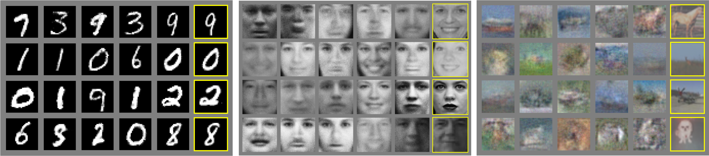</img>

From the generated samples, we see GAN can generate high quality samples, indicating the model does not simply memorize exact images from the training data. Training sets from left to right: [``MNIST``](https://yann.lecun.com/exdb/mnist/), ``Toronto Face Dataset (TFD)``, [``CIFAR-10``](https://www.cs.toronto.edu/~kriz/cifar.html). The highlighted columns show the nearest training example of the neighboring generated sample. 

There have been numerous followup studies on improving sample quality, training stability, and other aspects of GANs. The ICLR 2016 paper [[Radford et al., 2015]](https://arxiv.org/abs/1511.06434) proposed deep convolutional networks and other architecture features (deep convolutional generative adversarial networks, or DCGANs) to achieve better image quality and training stability: 

- Replace any pooling layers with strided convolutions (discriminator) and fractional-strided convolutions (generator).
- Use batchnorm in both the generator and the discriminator.
- Remove fully connected hidden layers for deeper architectures.
- Use ReLU activation in generator for all layers except for the output, which uses Tanh.
- Use LeakyReLU activation in the discriminator for all layers.

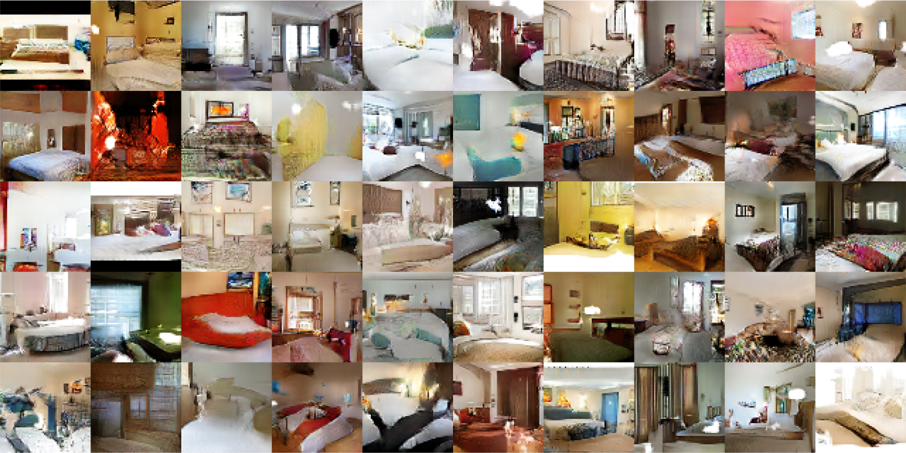</img>

Generated samples from DCGANs trained on [``LSUN``](https://www.yf.io/p/lsun) bedrooms dataset show promising improvements as the model can produce high resolution and high quality images without memorizing (overfitting) training examples. 

Similar to VAE, we are also able to find structures in the latent space and meaningfully interpolate random points in the latent space. This means we observe smooth semantic changes to the image generations along any direction of the manifold, which suggests that model has learned relevant  representations (as opposed to memorization). 

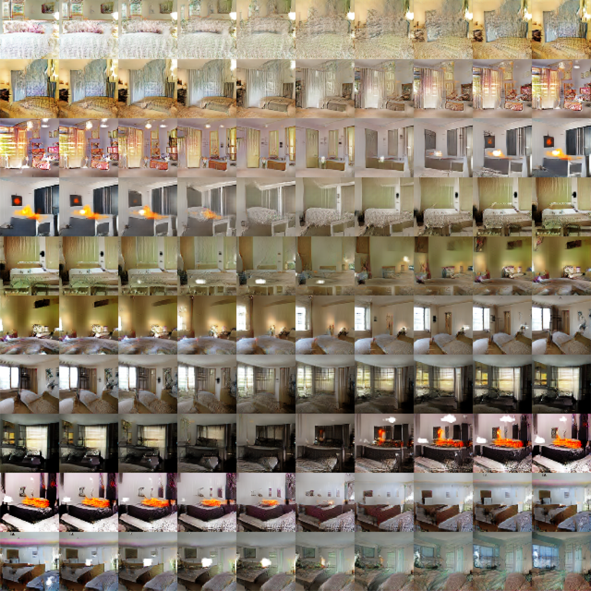</img>

The above figure shows smooth transitions between a series of $9$ random points in the latent space. Every image in the interpolation reasonably looks like a bedroom. For instance, generated samples in the $6$th row exhibit transition from a room without a window to a room with a large window; in the $10$th, an TV-alike object morphs into a window. 

Additionally, we can also perform arithmetic on $z$ vectors in the latent space. By averaging the $z$ vector for three exemplary generated samples of different visual concepts, we see consistent and stable generations that semantically obeyed the arithmetic. 

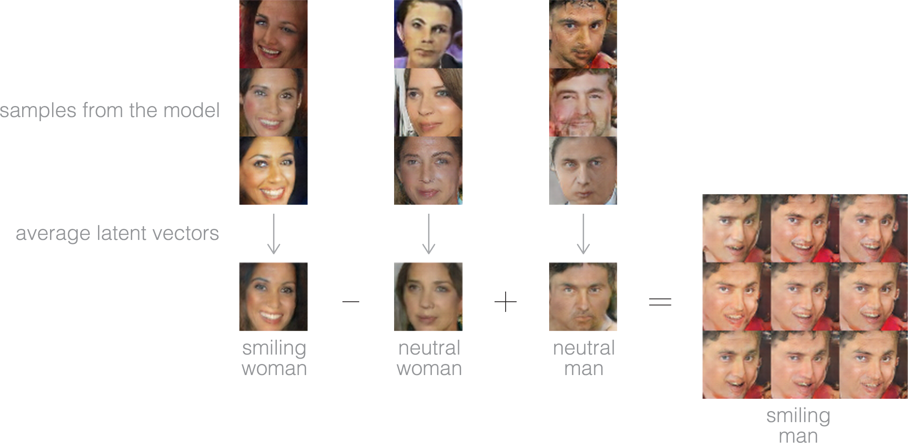</img>

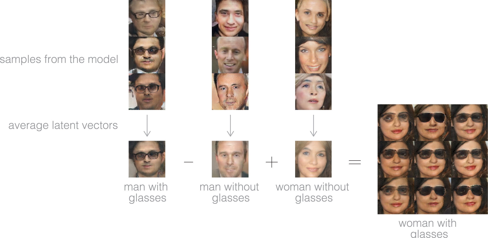</img>

Arithmetic is performed on the mean vectors and the resulting vector feeds into the generator to produce the center sample on the right hand side. The remaining samples around the center are produced by adding uniform noise in $[-0.25, 0.25]$ to the vector. 

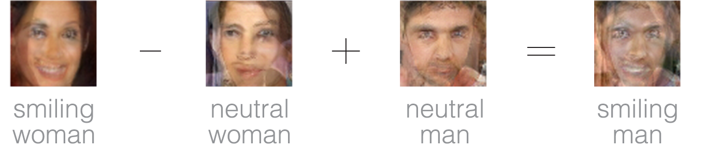</img>

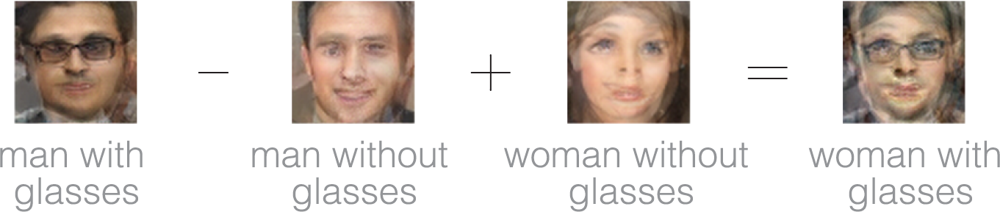</img>

We note that same arithmetic performed pixel-wise in the image space does not behave similarly, as it
only yields in noise overlap due to misalignment. Therefore latent representations learned by the model and associated vector arithmetic have the potential to compactly model conditional generative process of complex image distributions.

## Other Variants

- new loss function (LSGAN): [Mao et al., Least Squares Generative Adversarial Networks, 2016](https://arxiv.org/abs/1611.04076)
- new training methods: 
    - Wasserstein GAN: [Arjovsky et al., Wasserstein GAN, 2017](https://arxiv.org/abs/1701.07875)
    - Improved Wasserstein GAN: [Gulrajani et al., Improved Training of Wasserstein GANs, 2017](https://arxiv.org/abs/1704.00028)
    - Progressive GAN: [Karras et al., Progressive Growing of GANs for Improved Quality, Stability, and Variation, 2017](https://arxiv.org/abs/1710.10196)
- source-to-target domain transfer (CycleGAN): [Zhu et al., Unpaired Image-to-Image Translation using Cycle-Consistent Adversarial Networks, 2017](https://arxiv.org/abs/1703.10593)
- text-to-image synthesis: [Reed et al., Generative Adversarial Text to Image Synthesis, 2016](https://arxiv.org/abs/1605.05396)
- image-to-image translation (Pix2pix): [Isola et al., Image-to-Image Translation with Conditional Adversarial Networks, 2016](https://arxiv.org/abs/1611.07004)
- high-resolution and high-quality generations (BigGAN): [Brock et al., Large Scale GAN Training for High Fidelity Natural Image Synthesis, 2018](https://arxiv.org/abs/1809.11096)
- scene graphs to GANs: [Johnson et al., Image Generation from Scene Graphs, 2018](https://arxiv.org/abs/1804.01622)
- benchmark for generative models: [Zhou, Gordon, Krishna et al., HYPE: Human eYe Perceptual Evaluations, 2019](https://arxiv.org/abs/1904.01121)
- many more: ["the GAN zoo"](https://github.com/hindupuravinash/the-gan-zoo)